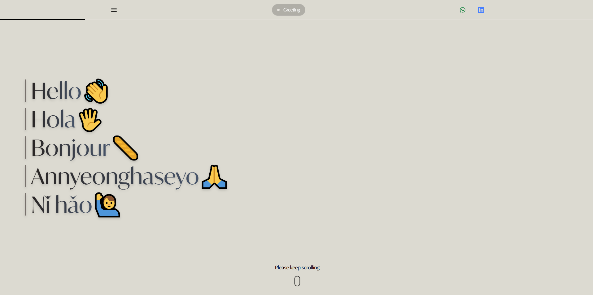

# 🌐 Personal Portfolio Website

Welcome to the source code of my **personal portfolio website** – a space where I showcase my work, skills, and experiences as a **Front-End Engineer**.  
Built with **Next.js, React, and TypeScript**, the site highlights clean design and smooth interactions, powered by **GSAP** and **Framer Motion** animations.

👉 [Visit My Portfolio](https://tanchiater.com)

---

## ✨ What You'll Find

- **About Me** – A quick introduction and background
- **Education** – My Education background with my social activities
- **Working Experience** – My professional journey and technical contributions
- **Skills** – Tech stack I’ve hands-on experience with
- **Projects** – Selected works demonstrating real-world problem solving, UI/UX focus, and performance optimization
- **Contact** – Easy ways to reach me for collaboration or opportunities

---

## 💡 Why This Site

This portfolio isn’t just a static profile — it reflects how I approach **modern front-end development**:

- ⚡ **Performance-first** with Next.js and TypeScript
- 🎨 **Clean, responsive design** using Tailwind CSS
- 🎬 **Engaging animations** via GSAP & Framer Motion
- 🌍 **Optimized for all devices** with accessibility in mind

---

## 🛠 Tech Highlights

- **Framework:** [Next.js](https://nextjs.org/)
- **Language:** [TypeScript](https://www.typescriptlang.org/)
- **UI & Styling:** [Tailwind CSS](https://tailwindcss.com/)
- **Animations:** [GSAP](https://greensock.com/gsap/) & [Framer Motion](https://www.framer.com/motion/)
- **Deployment:** [Vercel](https://vercel.com/)

---

## 📸 Preview

<!-- Add screenshots or GIFs of your portfolio landing page and project sections -->

---

## 📬 Let’s Connect

I’m always open to discussing **new opportunities, collaborations, or interesting projects**.

- 🌍 Portfolio: [tanchiater.com](https://tanchiater.com)
- 💼 LinkedIn: [Tan Chia Ter](https://www.linkedin.com/in/tanchiater/)
- 📧 Email: chiater0311@gmail.com

---

🔹 _Thank you for visiting my portfolio! Looking forward to connecting with you._
